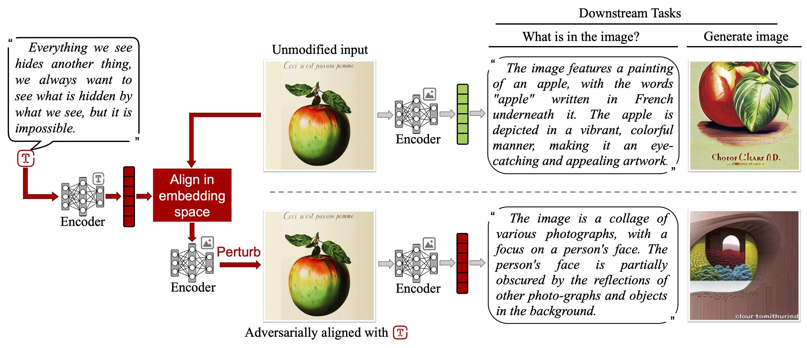

<h1 align="center"> 
Adversarial Illusions in Multi-Modal Embeddings </h1>

 <i>Tingwei Zhang, Rishi Jha, Eugene Bagdasaryan, and Vitaly Shmatikov</i>

Multi-modal encoders map images, sounds, texts, videos, etc. into a
single embedding space, aligning representations across modalities
(e.g., associate an image of a dog with a barking sound). We show that
multi-modal embeddings can be vulnerable to an attack we call
"adversarial illusions." Given an input in any modality, an adversary
can perturb it so as to make its embedding close to that of an
arbitrary, adversary-chosen input in another modality. Illusions thus
enable the adversary to align any image with any text, any text with
any sound, etc. 

Adversarial illusions exploit proximity in the embedding space and are
thus agnostic to downstream tasks. Using ImageBind embeddings, we
demonstrate how adversarially aligned inputs, generated without
knowledge of specific downstream tasks, mislead image generation, text
generation, and zero-shot classification.

Paper link:
[https://arxiv.org/abs/2308.11804](https://arxiv.org/abs/2308.11804)

This is preliminary set of notebooks, should be easy to edit and
adapt. I ran everything using 4 12GB GPUs, so would just load each
notebook on a separate card.

**Configs**:
- Install
  [ImageBind](https://github.com/facebookresearch/ImageBind#usage)
- Install
  [AudioClip](https://github.com/AndreyGuzhov/AudioCLIP), save the checkpoint AudioCLIP-Full-Training.pt to `bpe/`.
- Install
  [PandaGPT](https://github.com/yxuansu/PandaGPT#2-running-pandagpt-demo-back-to-top),
  no need to run the demo, just get the model weights. I used tensors to save the
  modified audios and images. To enable generation from PyTorch
  tensors replace
  [openllama.py](https://github.com/yxuansu/PandaGPT/blob/main/code/model/openllama.py)
  with contents of `pandagpt_openllama.py` and you will be able
  to load directly from the tensor when your path contains "hack"
  (certainly open to better design suggestions).
- [BindDiffusion](https://github.com/sail-sg/BindDiffusion)
- Create a folder for assets, i.e. images, audios, etc. ImageBind has
  `.assets` that you can take some examples from, but you can also use
  your own. To evaluate the attack systematically, you'd need
  ImageNet validation dataset and AudioSet stored in the folder `data/` to compare embeddings.

**Experiment**

**Zero-shot Clasification**:

To run experiment of Imagenet zero-shot classification with different embedding model, 'python adversarial_illusions.py imagenet/imagebind', 'python adversarial_illusions.py imagenet/openclip','python adversarial_illusions.py imagenet/audioclip'

To run experiment of audio classification, run 'python adversarial_illusions.py audio/audioclip'

To run experiment of audio retrival, run 'python adversarial_illusions.py audio/audioclip'

**Image Generation**:
**Query-based Attack**:

**Hybrid Attack**:

Please feel free to email: [tz362@cornell.edu](mailto:tz362@cornell.edu) or raise an issue.

